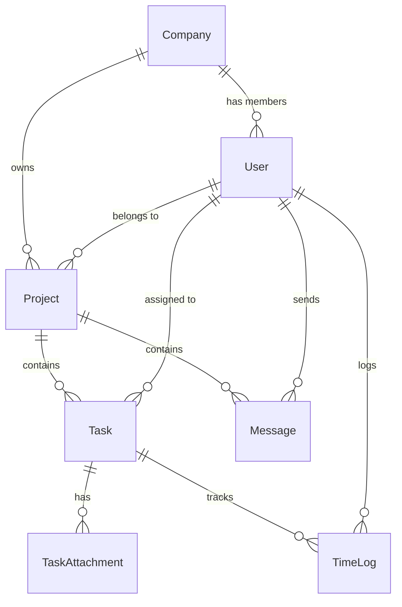

# 🛠️ The House of Engineers — Project Management Platform

Welcome to **The House of Engineers**, a premium, multi-tenant B2B Project & Task Management SaaS designed for collaborative engineering and development teams. The platform features role-based access, interactive drag-and-drop Kanban boards, team management, file attachments, and detailed time-logging.

---

## 🚀 Key Features

*   **🏢 Multi-Tenant Workspace & Company Onboarding:** Seamlessly register your company and set up dedicated organizational workspaces.
*   **📋 Interactive Drag-and-Drop Kanban Board:** Built with `@dnd-kit/core` for fluid task status updates across columns (Todo, In Progress, In Review, Completed, etc.).
*   **👥 Role-Based Access Control (RBAC):** Customized dashboards and permissions tailored for different roles:
    *   `owner` — Full workspace control, subscription, billing, and settings.
    *   `admin` — Manage team members, projects, clients, and generate reports.
    *   `member` — View assigned tasks, log active work time, and upload task attachments.
    *   `client` — Read-only access to relevant project boards and messaging.
*   **⏱️ Advanced Time Logging:** Track productivity by logging active hours on individual tasks.
*   **📎 Task Attachments:** Upload and manage task-related files directly from the UI.
*   **💬 Integrated Messaging:** Collaborate on projects with real-time comments and messages.

---

## 💻 Tech Stack

*   **Framework:** [Next.js 16](https://nextjs.org) (App Router, Server Components)
*   **Database ORM:** [Prisma ORM](https://www.prisma.io) with PostgreSQL
*   **Authentication & Storage:** [Supabase](https://supabase.com) (SSR/JS SDK) & JWT/Jose tokens
*   **State Management:** [Redux Toolkit](https://redux-toolkit.js.org) (`react-redux`)
*   **Data Fetching & Caching:** [TanStack React Query (v5)](https://tanstack.com/query)
*   **Drag and Drop:** [@dnd-kit/core](https://dnd-kit.com)
*   **UI Components:** [Radix UI](https://www.radix-ui.com), [Shadcn UI](https://ui.shadcn.com), & [Lucide Icons](https://lucide.dev)
*   **Styling:** Tailwind CSS (v4) with custom dark mode support

---

## 📂 Project Directory Structure

```text
├── prisma/
│   ├── schema.prisma       # Database models and relations
│   └── seed.ts             # Seeding mock projects, tasks, and users
├── public/                 # Static assets
└── src/
    ├── app/
    │   ├── (auth)/         # Login & Signup layouts
    │   ├── api/            # API endpoints (tasks, users, workspace)
    │   ├── company/        # Company registration onboarding
    │   └── dashboard/      # Nested, role-based dashboards ([id])
    ├── components/
    │   ├── ui/             # Reusable Shadcn component primitives
    │   ├── dashboard/      # Kanban board, TaskView, TeamView
    │   └── task/           # Task attachments, time-logs, detail drawers
    ├── dbConfig/           # DB connection setup
    ├── generated/          # Generated Prisma client output
    ├── helpers/            # Authentication, JWT, and email utils
    ├── hooks/              # Custom React hooks
    └── lib/                # Redux store, query clients, and utils
```

---

## 🗄️ Database Schema & Models

The PostgreSQL database is organized into the following relational structure:



### Key Models:
*   **`Company`**: Workspace settings, branding, status (`active`/`inactive`).
*   **`user`**: Profile data, verify/forgot-password tokens, and role (`owner`, `admin`, `member`, `client`).
*   **`Project`**: Core units of work grouped under companies.
*   **`Task`**: Actions within projects, tracking status (`pending`, `in_progress`, `completed`, `reopen`, `in_review`, `blocked`) and priority (`high`, `medium`, `low`).
*   **`TaskAttachment`**: Files linked to a task.
*   **`timeLog`**: Log entries detailing work intervals (`startTime`, `endTime`, `duration`).
*   **`Message`**: Team communication thread items.

---

## 🛠️ Quickstart Guide

### 1. Prerequisites
Ensure you have Node.js (v18+) and a PostgreSQL instance ready.

### 2. Install Dependencies
```bash
npm install
```

### 3. Setup Environment Variables
Create a `.env` file in the root directory and configure the variables:
```env
# PostgreSQL connection strings
DATABASE_URL="postgresql://<username>:<password>@<host>:<port>/<db>?pgbouncer=true"
DIRECT_URL="postgresql://<username>:<password>@<host>:<port>/<db>"

# JWT Configuration
JWT_SECRET="your_secure_jwt_secret"

# Supabase Configurations
NEXT_PUBLIC_SUPABASE_URL="https://your-project.supabase.co"
NEXT_PUBLIC_SUPABASE_PUBLISHABLE_KEY="your-supabase-publishable-key"
```

### 4. Database Setup & Client Generation
Run migrations or push the schema structure to your PostgreSQL instance, then generate the Prisma Client:
```bash
npx prisma db push
npx prisma generate
```

### 5. Seed Database
Populate your database with mock companies, users, projects, tasks, and time logs:
```bash
npm run seed
```

### 6. Run the Application
Launch the local Next.js development server:
```bash
npm run dev
```
Open [http://localhost:3000](http://localhost:3000) in your browser to view the application.

---

## 👥 Seed Users for Testing

After seeding the database, you can log in using these mock accounts (password is `hashed_password` - replace or check verification in seed helper):

| Name | Email | Role | Access Level |
| :--- | :--- | :--- | :--- |
| **John Owner** | `owner@acme.com` | `owner` | Company Owner (Full access) |
| **Sarah Admin** | `admin@acme.com` | `admin` | Administrator |
| **Mike Developer** | `mike@acme.com` | `member` | Workspace Member |
| **Emma Designer** | `emma@acme.com` | `member` | Workspace Member |
| **Robert Client** | `client@example.com` | `client` | External Client |

---

## 🔗 Key API Reference

*   `POST /api/users/signup` — Register a new account.
*   `POST /api/users/login` — Log in and receive session cookies.
*   `POST /api/users/logout` — End user session.
*   `GET /api/tasks` — Fetch tasks for the current user/project.
*   `PATCH /api/tasks` — Update task fields (e.g., status, priority).
*   `POST /api/tasks/attachments` — Upload attachments.
*   `POST /api/tasks/time-logs` — Log working hours.
