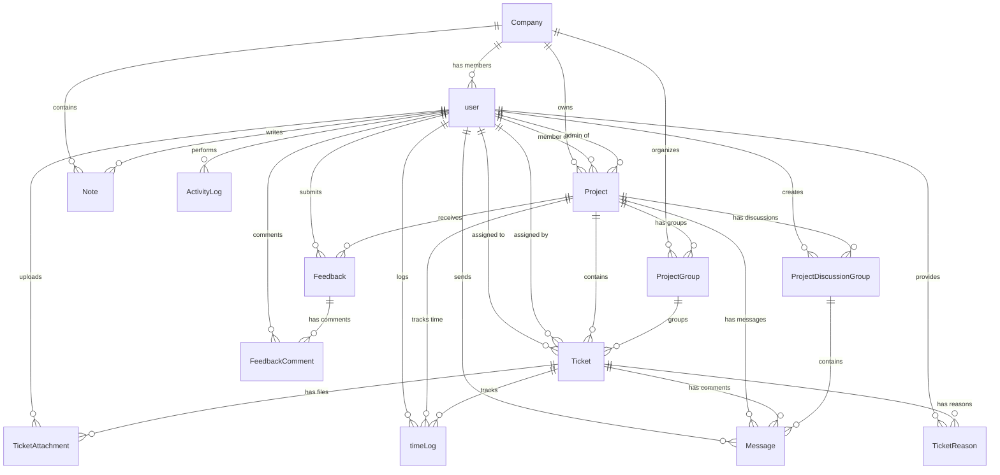

# Relay - Move The Work Forward

> **Status:** 🚧 In Last Phase of Development (Optimization and polishing left)

A premium, multi-tenant **B2B Project & Task Management SaaS** built for collaborative engineering and development teams. The platform delivers role-based dashboards, interactive Kanban boards, sprint/milestone planning, real-time messaging, granular time-tracking, and a built-in feedback system — all wrapped in a polished dark-mode UI.

---

## ✨ Feature Highlights

### 🏢 Multi-Tenant Workspaces
- Company registration and onboarding flow
- Dedicated organizational workspaces with branding and status management
- Invite-based team growth (members & external clients)

### 📋 Interactive Kanban Board
- Drag-and-drop ticket management powered by `@dnd-kit/core`
- Columns: **Pending → In Progress → In Review → Completed → Blocked → Backlog → Reopen**
- Inline ticket detail drawers with comments, attachments, time logs, and history

### 🎯 Sprint & Milestone Planning
- Create **Project Groups** (sprints, phases, sections, milestones, campaign stages, or custom)
- Group-level status tracking: `not_started` → `in_progress` → `completed` / `on_hold` / `cancelled`
- Sprint detail views with ticket breakdowns

### 🎫 Advanced Ticket System
- Ticket types: `feature`, `bug`, `task`, `improvement`, `documentation`, `other`
- Priority levels: `high`, `medium`, `low`
- Estimated hours tracking per ticket
- Block/reopen reason history with full audit trail
- File attachments via Supabase Storage with uploader tracking

### 👥 Role-Based Access Control (RBAC)
| Role | Access Level |
|:---|:---|
| **Owner** | Full workspace control — billing, settings, team management |
| **Admin** | Manage projects, teams, clients, and generate reports |
| **Member** | View assigned tickets, log time, upload attachments |
| **QA** | Quality assurance workflows |
| **Client** | Read-only access to relevant project boards and messaging |

### ⏱️ Time Tracking & Analytics
- Start/stop timers on individual tickets
- Duration-based logging with descriptions
- Project-level and user-level time aggregation
- Visual analytics with **Recharts** (bar, line, pie charts)

### 💬 Real-Time Messaging & Discussions
- Project-scoped messaging with **Ably** real-time infrastructure
- **Discussion Groups** per project: `general`, `discussion`, `suggestion`, `complaint`, `decision`, `question`, `announcement`, `feedback`, `improvement`
- Pin and archive discussion threads
- Ticket-level comment threads with read/star/delete support

### 📊 Activity Logging
- Comprehensive audit trail for all workspace actions
- Tracked events: project CRUD, ticket lifecycle, member management, file uploads, role changes, comments, and more
- Metadata-rich logs with target user tracking

### 💡 Feedback System
- Submit feedback as `bug`, `feature`, `improvement`, `add_remove`, `question`, or `other`
- Priority: `low`, `medium`, `high`, `critical`
- Status workflow: `pending` → `in_progress` → `resolved` / `rejected`
- Threaded comments on feedback items

### 📝 Notes
- Personal notes scoped to company workspace
- Simple task-list style with completion tracking

### 🔐 Authentication & Security
- JWT-based auth with `jose` token verification
- Middleware-protected routes with automatic redirects
- Email verification and forgot-password token flows via `Nodemailer`
- Password hashing with `bcryptjs`
- Role-verified API endpoints with `requireRole` middleware

---

## 💻 Tech Stack

| Layer | Technology |
|:---|:---|
| **Framework** | [Next.js 16](https://nextjs.org) — App Router, Server Components, API Routes |
| **Language** | TypeScript 5 |
| **Database** | PostgreSQL via [Prisma ORM v7](https://www.prisma.io) with `@prisma/adapter-pg` |
| **Auth & Storage** | [Supabase](https://supabase.com) (SSR SDK) + JWT / Jose tokens |
| **Real-Time** | [Ably](https://ably.com) — pub/sub messaging |
| **State Management** | [Redux Toolkit](https://redux-toolkit.js.org) + React-Redux |
| **Data Fetching** | [TanStack React Query v5](https://tanstack.com/query) |
| **Drag & Drop** | [@dnd-kit/core](https://dnd-kit.com) |
| **Charts** | [Recharts](https://recharts.org) |
| **UI Components** | [Radix UI](https://www.radix-ui.com) + [Shadcn UI](https://ui.shadcn.com) + [Lucide Icons](https://lucide.dev) |
| **Styling** | Tailwind CSS v4 + custom dark mode (`next-themes`) |
| **Notifications** | [Sonner](https://sonner.emilkowal.dev) toast system |
| **HTTP Client** | [Axios](https://axios-http.com) |
| **Date Utils** | [date-fns](https://date-fns.org) |

---

## 📂 Project Structure

```
├── prisma/
│   ├── migrations/          # Versioned database migrations
│   ├── schema.prisma        # 15+ models, enums, and relations
│   └── seed.ts              # Seeds companies, users, projects, tickets, groups, and time logs
├── public/                  # Static assets (favicon, images)
└── src/
    ├── app/
    │   ├── (auth)/
    │   │   ├── login/       # Login page
    │   │   ├── signup/      # Registration page
    │   │   └── change-password/
    │   ├── api/
    │   │   ├── ably/        # Real-time token auth endpoint
    │   │   ├── feedback/    # CRUD + comments for feedback
    │   │   ├── projects/    # Project CRUD + [projectId] details
    │   │   ├── teams/       # Team member management
    │   │   ├── tickets/     # Ticket CRUD, attachments, time-logs
    │   │   ├── time-logs/   # Time tracking endpoints
    │   │   ├── users/       # Auth (signup, login, logout, me, change-password)
    │   │   └── workspace/   # Workspace/company creation
    │   ├── company/
    │   │   └── create/      # Company onboarding wizard
    │   └── dashboard/
    │       └── [id]/        # Dynamic role-based dashboard
    │           ├── clients/
    │           ├── feedback/
    │           ├── profile/
    │           ├── projects/
    │           ├── teams/
    │           ├── tickets/
    │           └── timelogs/
    ├── components/
    │   ├── ui/              # 26 Shadcn/Radix primitives (dialog, sheet, tabs, calendar…)
    │   ├── dashboard/       # Kanban board, onboarding, team view, time logs view, user profile
    │   ├── project/         # Project overview, groups/sprints, discussions, files, team, tickets
    │   ├── ticket/          # Ticket detail, comments, attachments, time logs, reason history
    │   └── feedback/        # Feedback list, stats, detail modal, submit form
    ├── helpers/
    │   ├── auth.ts          # JWT verification & user extraction
    │   └── permission.ts    # Role-based middleware (requireRole)
    ├── hooks/
    │   └── use-mobile.ts    # Responsive breakpoint hook
    ├── lib/
    │   ├── ably.ts          # Ably REST client setup
    │   ├── prisma.ts        # Prisma client singleton
    │   ├── store.ts         # Redux store configuration
    │   ├── utils.ts         # Utility helpers (cn, etc.)
    │   └── redux/
    │       ├── providers.tsx # Redux Provider wrapper
    │       └── userSlice.ts # User state slice
    ├── generated/           # Auto-generated Prisma Client
    └── proxy.ts             # Middleware — route protection & role-based redirects
```

---

## 🗄️ Database Schema

The PostgreSQL database contains **15 models** with rich relational structure:



### Key Models

| Model | Description |
|:---|:---|
| `Company` | Workspace tenant — name, branding, status (`active`/`inactive`) |
| `user` | Profiles with auth tokens, roles, designation, and active status |
| `Project` | Core work units with phase tracking (`idea` → `deployment`), category, and dates |
| `ProjectGroup` | Sprint/milestone containers with status and date ranges |
| `ProjectDiscussionGroup` | Threaded discussion channels per project |
| `Ticket` | Actionable items with status, priority, type, estimated hours, and soft-delete |
| `TicketAttachment` | Files linked to tickets with uploader tracking |
| `TicketReason` | Audit entries for `BLOCKED` / `REOPENED` state changes |
| `timeLog` | Work interval records with start/end times and duration |
| `Message` | Communication items scoped to projects, tickets, or discussion groups |
| `Note` | Personal workspace notes with completion tracking |
| `ActivityLog` | Audit trail with 20+ action types and JSON metadata |
| `Feedback` | User-submitted feedback with type, priority, and status workflow |
| `FeedbackComment` | Threaded replies on feedback items |

---

## 🛠️ Getting Started

### Prerequisites

- **Node.js** v18+
- **PostgreSQL** instance (local or hosted, e.g., Supabase)
- **Supabase** project (for auth SSR and file storage)
- *(Optional)* **Ably** account for real-time messaging

### 1. Install Dependencies

```bash
npm install
```

### 2. Configure Environment Variables

Create a `.env` file in the project root:

```env
# ── Database ──────────────────────────────────────────────
DATABASE_URL="postgresql://<user>:<password>@<host>:<port>/<db>?pgbouncer=true"
DIRECT_URL="postgresql://<user>:<password>@<host>:<port>/<db>"

# ── Authentication ────────────────────────────────────────
JWT_SECRET="your_secure_jwt_secret"

# ── Supabase ──────────────────────────────────────────────
NEXT_PUBLIC_SUPABASE_URL="https://your-project.supabase.co"
NEXT_PUBLIC_SUPABASE_PUBLISHABLE_KEY="your-supabase-anon-key"

# ── Real-Time (Optional) ─────────────────────────────────
ABLY_API="your-ably-api-key"
```

### 3. Set Up the Database

Push the schema and generate the Prisma Client:

```bash
npx prisma db push
npx prisma generate
```

### 4. Seed the Database

Populate mock data (company, users, projects, groups, tickets, time logs):

```bash
npm run seed
```

### 5. Start the Dev Server

```bash
npm run dev
```

Open [http://localhost:3000](http://localhost:3000) to view the application.

---

## 👥 Test Accounts

After seeding, log in with any of these accounts (password: `hashed_password`):

| Name | Email | Role | Designation |
|:---|:---|:---|:---|
| **John Owner** | `owner@acme.com` | `owner` | CEO |
| **Sarah Admin** | `admin@acme.com` | `admin` | Project Manager |
| **Mike Developer** | `mike@acme.com` | `member` | Backend Developer |
| **Emma Designer** | `emma@acme.com` | `member` | *(seeded)* |
| **Robert Client** | `client@example.com` | `client` | External Client |

---

## 🔗 API Reference

### Authentication

| Method | Endpoint | Description |
|:---|:---|:---|
| `POST` | `/api/users/signup` | Register a new account |
| `POST` | `/api/users/login` | Log in and receive session cookie |
| `POST` | `/api/users/logout` | End user session |
| `GET` | `/api/users/me` | Get current authenticated user |
| `PATCH` | `/api/users/change-password` | Change user password |
| `GET/PATCH` | `/api/users/[id]` | Get or update user profile |

### Projects

| Method | Endpoint | Description |
|:---|:---|:---|
| `GET/POST` | `/api/projects` | List or create projects |
| `GET/PATCH/DELETE` | `/api/projects/[projectId]` | Project CRUD by ID |

### Tickets

| Method | Endpoint | Description |
|:---|:---|:---|
| `GET/POST/PATCH` | `/api/tickets` | List, create, or update tickets |
| `GET/PATCH/DELETE` | `/api/tickets/[ticketId]` | Ticket CRUD by ID |
| `POST` | `/api/tickets/attachments` | Upload file attachments |
| `POST/GET` | `/api/tickets/time-logs` | Log or retrieve time entries |

### Teams

| Method | Endpoint | Description |
|:---|:---|:---|
| `GET/PATCH/DELETE` | `/api/teams/[id]` | Manage team members |

### Time Logs

| Method | Endpoint | Description |
|:---|:---|:---|
| `GET/POST/PATCH` | `/api/time-logs` | Aggregated time log operations |

### Feedback

| Method | Endpoint | Description |
|:---|:---|:---|
| `GET/POST` | `/api/feedback` | List or submit feedback |
| `GET/PATCH` | `/api/feedback/[id]` | Feedback detail and updates |

### Workspace

| Method | Endpoint | Description |
|:---|:---|:---|
| `POST` | `/api/workspace/create` | Create a new company workspace |

### Real-Time

| Method | Endpoint | Description |
|:---|:---|:---|
| `GET` | `/api/ably` | Generate Ably token for client auth |

---

## 🏗️ Architecture Decisions

- **Middleware-first auth** — `proxy.ts` intercepts all `/dashboard` routes, verifies JWTs, and handles role-based redirects before the page renders.
- **Server-side permission checks** — Every API route uses `requireRole()` to verify the caller's role against the database in real-time, preventing stale-token exploits.
- **Prisma with `@prisma/adapter-pg`** — Direct `pg` pool integration for connection-pooling compatibility with Supabase/PgBouncer.
- **Hybrid state management** — Redux Toolkit for global UI state (user session) + TanStack Query for server-state caching and invalidation.
- **Real-time layer** — Ably REST SDK on the server issues tokens; clients subscribe to project-scoped channels for live updates.

---

## 📄 License

This project is private and not currently licensed for public distribution
